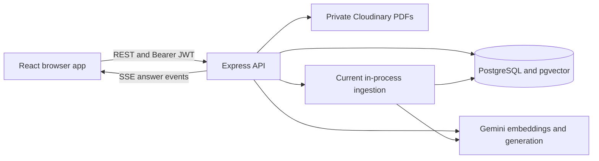

# DocuMind AI — Product Specification and Roadmap

Updated: 7 September 2026.

DocuMind AI lets users upload private PDFs, select documents, and ask questions answered from retrieved passages with source citations. It demonstrates full-stack engineering and practical Retrieval-Augmented Generation (RAG) using Google Gemini.

This document describes the product, current code baseline, and remaining release requirements. [PROJECT_GUIDE.md](PROJECT_GUIDE.md) explains implementation details. [IMPLEMENTATION_PLAN.md](IMPLEMENTATION_PLAN.md) orders the remaining work and defines acceptance checks. Status reflects the current working tree, including the recently applied CI patch; it does not imply deployment or a successful hosted CI run.

## 1. Goals and audience

Students, researchers, developers, and small teams should be able to:

- Find facts, dates, requirements, and explanations inside their PDFs.
- Compare information across up to ten selected documents.
- Read structured answers, tables, and source-backed charts when appropriate.
- Inspect evidence and reopen saved conversations.
- Manage private documents without exposing them to other users.

The release goal is a reliable, reproducible public demo with tested data isolation, recoverable processing, useful citations, and documented limitations. Correctness, security, and reliable RAG take priority over advanced features.

## 2. Current implementation status

“Implemented” means present in source. External-service behavior still needs dedicated integration and end-to-end verification.

| Area | Current state | Remaining release work |
|---|---|---|
| Foundation | TypeScript npm monorepo, React/Vite web, Express API, shared Zod schemas, ESLint, pinned Node and container setup | Verify container startup on Docker-capable infrastructure |
| Authentication | Register/login/logout/me, in-memory access JWT, hashed opaque rotating refresh tokens, session restoration | Production configuration validation, cookie/CSRF checks, database-backed session tests |
| Documents | Single-PDF upload, private Cloudinary storage, listing, source URL, retry, deletion, selection and polling | Durable processing, concurrency-safe quotas, lifecycle integration tests |
| Ingestion | Page-aware extraction, normalization, overlapping chunks, Gemini embeddings, transactional persistence | Worker, retry policy, stale-job recovery and bounded resources |
| Retrieval | Owner/document filters, 768-dimensional vectors, cosine search, HNSW index in migration | Database tests, query-plan verification and measured relevance tuning |
| Chat | Draft UI, conversation CRUD API, selected-document history, SSE answers, persistence | Follow-up context, cancellation/failure recovery, rename UI |
| Answers | Markdown, validated bar/line/area/pie charts, citation excerpts | Document/page metadata in citation responses, source-deletion behavior |
| Checks | Vitest/Supertest suites, real lint, test-runner guards, isolated database suite and expanded CI | Run database/container jobs, add browser tests and RAG evaluation |
| Operations | Liveness, database readiness, timing logs, route limits | Request IDs, structured logs, usage capture, deployment and monitoring |

Phase 1 local verification passed real lint, type checking, 27 existing tests, three new test-runner safety tests, production builds and Prisma validation. Six PostgreSQL/pgvector integration cases and container CI checks are added but have not run locally because Docker/PostgreSQL are unavailable. Live Gemini/Cloudinary and browser behavior remain unverified. The web build still reports a bundle-size warning.

## 3. Architecture and conventions

Keep React/Vite + Express, PostgreSQL/pgvector, Prisma, and authenticated Cloudinary storage. A Next.js migration is not required for this roadmap. Framework or storage-provider changes are separate decisions.

| Layer | Current implementation |
|---|---|
| Web | React 18, Vite 5, TypeScript, React Router 7 |
| State and forms | TanStack Query 5, AuthContext, React Hook Form, Zod |
| UI | Tailwind CSS 3, existing shared CSS utilities, Lucide, Sonner; no installed shadcn component system |
| Answers | react-markdown, remark-gfm, Recharts with validated chart specifications |
| API | Node.js, Express 4, TypeScript, Multer 2.x |
| Database | PostgreSQL, pgvector, Prisma 7 and PostgreSQL adapter |
| Private PDFs | Cloudinary authenticated assets and expiring source URLs |
| AI | Backend-only `@google/genai`, embedding and generation interfaces |
| Checks | ESLint 10, Vitest, Supertest, TypeScript builds, GitHub Actions unit/database/container jobs |
| Local infrastructure | Docker Compose with pgvector, API/migration images and nginx web image |
| Planned infrastructure | Durable ingestion worker/queue and production release pipeline |



```text
apps/web/src/
  context/             Authentication state
  features/            Auth, document library, chat and answer rendering
  lib/                 Reusable browser logic
  services/            Typed HTTP and SSE clients
  types/               API response types
  App.tsx              Routes and client-side access guards
apps/api/src/
  config/              Environment configuration
  middleware/          Authentication and shared request behavior
  modules/             ai, auth, chat, documents, ingestion, retrieval
  shared/              Database client
  generated/prisma/    Generated code; regenerate rather than edit
  app.ts               Middleware, routes, health and errors
  server.ts            Process startup and shutdown
packages/shared/       Shared Zod input schemas and types
prisma/                Schema and SQL migrations
scripts/               Operational helpers
.github/workflows/     CI baseline
```

Extend feature folders and service interfaces. Use frontend `@/` imports, typed requests, shared validation where appropriate, and existing error envelopes. Express 4 async handlers must forward errors. The recreated [SKILL.md](SKILL.md) now describes this monorepo and its verification commands.

## 4. Current product flows

### Authentication

Registration/login return an access JWT and set an HttpOnly refresh cookie. The browser keeps the JWT in memory. Concurrent 401 responses share a refresh request; the API rotates the opaque refresh token and stores only its hash. Logout revokes the refresh session. Refresh tokens are not JWTs, and `JWT_REFRESH_SECRET` is currently unused.

### PDF ingestion

1. An authenticated user uploads one PDF through a file picker or drag-and-drop.
2. The API checks extension, declared MIME type, size, count, and `%PDF-` signature. Defaults are 20 MB per file and 20 documents per user.
3. Cloudinary stores the private original; the API creates a `PENDING` document and starts ingestion in process.
4. Ingestion claims `PROCESSING`, extracts normalized page text, chunks and embeds it, then commits chunks and `READY` status transactionally. Failures produce `FAILED` and a safe error code.
5. The library polls every five seconds while processing is pending or active. Only ready documents are selectable for chat.

Chunking currently uses **800 whitespace-separated words with 120-word overlap**, not measured model tokens. Embeddings use 768 dimensions in batches of up to 32 with a 30-second request timeout. Content hashes are stored but do not implement an embedding cache. Scanned/image-only PDFs fail with `NO_EXTRACTABLE_TEXT`; OCR is absent.

Ingestion is a fire-and-forget promise inside the API. Restarting can strand `PENDING`/`PROCESSING` records; the retry endpoint currently accepts only `FAILED` documents. Uploads and processing buffer data in memory. Durable recovery and bounded resource use are release requirements.

### Questions and answers

1. Selecting 1–10 ready PDFs opens a draft; the UI creates the conversation when the first question is submitted.
2. The API validates ownership, saves the user message and a `STREAMING` assistant message, then embeds the question.
3. Retrieval checks selected documents are owned and ready, then restricts SQL search by user and selected IDs. It returns eight chunks by default.
4. With no results or a top similarity score below 0.25, the API streams an insufficient-information answer. Otherwise it builds a numbered-source prompt and streams Gemini output.
5. The server saves the answer, latency, and in-range citation markers, then emits completion. The browser refetches persisted messages.

Generation currently allows 2,048 output tokens. Prior conversation messages are not supplied to Gemini, so follow-ups can lose context. Chunk sizes and relevance thresholds are implementation defaults, not validated quality targets.

The prompt treats source text as untrusted and asks for source-only factual answers and citations. Marker-range validation does not prove claim support. Chart JSON is schema-validated and rendered without executing generated code; factual chart accuracy still needs evaluation.

The web routes are `/login`, `/register`, `/` (document library), and `/chat/:conversationId`. Settings, usage, admin and separate dashboard/landing screens are not implemented. Conversation rename exists in the API but has no web UI.

### Sources and deletion

The source endpoint verifies ownership and returns a URL with a five-minute expiry. Saved citation responses contain excerpts and chunk IDs, but do not join document names and page ranges for the source panel.

Document deletion removes the Cloudinary asset first and then the database document. Cascades remove chunks, selected-document links, and associated citations. Existing message text remains and may contain orphaned citation markers. Cross-service deletion is not atomic; recovery and explicit “source deleted” presentation are release requirements.

## 5. Data and API contracts

The authoritative schema is [prisma/schema.prisma](prisma/schema.prisma).

| Model | Purpose and constraints |
|---|---|
| User | Unique normalized email and password hash |
| RefreshToken | Unique token hash, owner, expiry and revocation |
| Document | Owner, Cloudinary storage metadata, byte size, pages and processing state |
| DocumentChunk | Unique document/chunk index, text, pages, approximate count, content hash, `vector(768)` |
| Conversation | Owner, title and timestamps |
| ConversationDocument | Composite-key document selection |
| Message | User/assistant role, text, `STREAMING`/`COMPLETED`/`FAILED`, latency and nullable token fields |
| MessageCitation | Chunk link, excerpt, score and unique citation number per message |

Token fields exist but generation does not populate them. Changing embedding dimensions requires a coordinated schema/index migration and re-embedding. Changing embedding models can require re-embedding even when dimensions stay the same.

All paths below use `/api/v1`. Preserve payloads unless a documented migration changes them.

| Area | Existing endpoints |
|---|---|
| Health | `GET /health/live`, `GET /health/ready` |
| Authentication | `POST /auth/register`, `/auth/login`, `/auth/refresh`, `/auth/logout`; `GET /auth/me` |
| Documents | `POST /documents`, `GET /documents`, `GET /documents/:documentId`, `DELETE /documents/:documentId` |
| Document actions | `POST /documents/:documentId/retry`, `GET /documents/:documentId/source` |
| Conversations | `POST /conversations`, `GET /conversations`; `GET`, `PATCH`, `DELETE /conversations/:conversationId` |
| Chat | `POST /conversations/:conversationId/messages` with `{ question }` |

Creation accepts `{ documentIds }`; rename accepts `{ title }`. Conversation listing supports a comma-separated `documentIds` filter and returns nonempty conversations whose documents are contained in that selection. Resources use their existing envelopes; there is no universal `{ success, data }` wrapper. Feedback/profile/usage endpoints are future work.

Typical errors use `{ "error": { "code": "DOCUMENT_NOT_FOUND", "message": "Document not found." } }`; validation can add details. Request IDs are planned. Preserve the SSE events:

```text
event: chunk
data: {"text":"partial answer"}

event: done
data: {"messageId":"...","citations":[1],"invalidCitations":[]}

event: error
data: {"code":"CHAT_GENERATION_FAILED","message":"The answer could not be generated."}
```

## 6. Remaining release requirements

### Reliable processing

- Durable dispatch and an independently restartable ingestion worker.
- Stale-job recovery, bounded concurrency, transient-failure retries and idempotent commits.
- Recovery between database persistence and queue publication; safe deletion during queued/active work.
- Bounded upload/parse resources and concurrency-safe document-count/byte quotas.
- Recoverable storage/database deletion.

### Security and operations

- Reject weak/default production signing secrets and incomplete storage configuration at startup.
- Define allowed origins and CSRF protection for cookie-based refresh/logout, tested in the deployed topology.
- Validate identifiers and map malformed upload/input failures to safe 4xx responses.
- Add request IDs, redacted structured logs, appropriate rate limits and retention/deletion policy.
- Capture model identity, actual reported usage, latency and failures; unknown usage must not become zero cost.
- Keep credentials server-side and avoid logging documents, prompts, tokens or signed URLs.

### Chat and evidence

- Bounded follow-up context or question rewriting while retaining source-only grounding.
- Citation document/page metadata and owner-authorized source links.
- Deleted-source display and explicit removal/retention rules for source-derived excerpts.
- Overall generation timeout, cancellation handling, stale-message recovery and duplicate-submission protection.
- Rename UI and keyboard/mobile/error-state verification.

### Verification and delivery

- Run the added PostgreSQL/pgvector suite and container smoke checks in CI; real workspace linting now passes locally.
- Playwright coverage for sessions, PDF-to-answer flow, persistence and two-user isolation.
- Versioned RAG evaluation before retrieval tuning or embedding-model changes.
- Verify added development containers; implement controlled production migrations, staging checks, monitoring and rollback procedures.
- Public demo and README with measured results and honest limitations.

## 7. Configuration and local development

Use Node **24.18.0**, pinned in `.node-version`, package engines, CI and Node container images. This matches local verification and installed Prisma's compatibility range.

Copy [.env.example](.env.example) to `.env` only if no local `.env` exists, then supply development credentials. Never commit secrets.

| Configuration | Current meaning |
|---|---|
| `DATABASE_URL` | Runtime PostgreSQL connection with pgvector available |
| `DIRECT_URL` | Optional direct connection preferred by Prisma migration configuration |
| `JWT_ACCESS_SECRET` | Signing secret; production validation needs hardening |
| `JWT_ACCESS_EXPIRES_IN`, `REFRESH_TOKEN_EXPIRES_DAYS` | Defaults: 15 minutes and 7 days |
| `GEMINI_API_KEY` | Backend-only Gemini credential |
| `GEMINI_CHAT_MODEL`, `GEMINI_EMBEDDING_MODEL` | Repository defaults: `gemini-3.5-flash`, `gemini-embedding-2`; verify account availability before deployment |
| `CLOUDINARY_CLOUD_NAME`, `CLOUDINARY_API_KEY`, `CLOUDINARY_API_SECRET` | Required for functioning document operations |
| `NODE_ENV`, `PORT`, `WEB_ORIGIN` | Runtime mode, API port (4000), allowed browser origin |
| `VITE_API_URL` | Web API origin; empty locally uses Vite's `/api` proxy |
| `MAX_FILE_SIZE_MB`, `MAX_DOCUMENTS_PER_USER` | Defaults: 20 MB and 20 documents |
| `JWT_REFRESH_SECRET`, `STORAGE_DIR` | Present but unused |

Embedding dimensions are a code/schema constant, not an implemented environment setting. There is no active S3 or local-filesystem provider.

Against an isolated development database:

```bash
npm ci
npm run prisma:generate
npm run prisma:migrate
npm run build --workspace=@documind/shared
```

`prisma:migrate` creates/applies development migrations. Use `npx prisma migrate deploy` for reviewed existing migrations in staging/production. `node scripts/check-database.mjs` diagnoses the configured database when needed.

Start these long-running processes in separate terminals:

```bash
npm run dev --workspace=@documind/shared
npm run dev --workspace=@documind/api
npm run dev --workspace=@documind/web
```

Open `http://localhost:5173`; the API defaults to port 4000. Separate terminals avoid relying on the root workspace delegator to run long-lived processes concurrently.

```bash
npm run check
```

This runs real lint, type checking, tooling/unit tests, builds and Prisma validation. Generate Prisma first on a clean checkout. Tests build the shared package before running. See [DEVELOPMENT.md](DEVELOPMENT.md) for `compose.yaml` and `npm run test:integration`, which requires an explicit dedicated local `TEST_DATABASE_URL`. There is no `test:e2e` or `db:migrate` script yet.

## 8. CI and release acceptance

The expanded [.github/workflows/ci.yml](.github/workflows/ci.yml) runs checks, isolated migrated pgvector integration tests, and container startup/SPA/API-proxy smoke checks in independent jobs on pull requests and pushes to `main`. Provider calls are mocked in integration tests. A separate dependency workflow publishes informational audit reports, and Dependabot proposes updates. Hosted runs are not yet verified. Automated production deployment is absent; readiness checks the database and reports Gemini as configured without probing it.

Release acceptance requires evidence for every item:

- [ ] Clean checkout installs, generates Prisma, migrates a fresh database and starts from documented commands.
- [ ] CI runs real lint, type checks, unit tests, database integration tests and production builds.
- [ ] Users can register, restore sessions and log out; invalid/replayed refresh sessions fail safely.
- [ ] Valid PDFs reach `READY`; invalid inputs fail clearly; interrupted ingestion recovers.
- [ ] Concurrent uploads/retries cannot bypass quotas or duplicate chunks.
- [ ] Users receive streamed saved answers and can inspect correct source documents/pages.
- [ ] Follow-ups preserve bounded context; insufficient evidence produces a clear fallback.
- [ ] A second user cannot access another user's files, sources, chats, citations or retrieved chunks.
- [ ] Deletion removes private source data according to policy and leaves understandable chat history.
- [ ] Disconnects, failures and restarts cannot leave indefinitely streaming messages without recovery.
- [ ] Browser tests and a versioned RAG evaluation report demonstrate the core behavior.
- [ ] Production configuration, monitoring, migrations and rollback are tested in staging.
- [ ] A public demo and README include measured results and known limitations.

Unchecked items are release gates, not claims that the underlying features are entirely absent.

## 9. Delivery order and future scope

The detailed [implementation plan](IMPLEMENTATION_PLAN.md) follows this order:

1. Effective quality checks and reproducible setup.
2. Production configuration and request/session boundaries.
3. Durable ingestion and deletion recovery.
4. Citation provenance and follow-up chat.
5. Usage capture and operational visibility.
6. Browser tests and measured RAG quality.
7. Staging, deployment and portfolio delivery.

Durable ingestion and baseline RAG evaluation move into release requirements because they address current reliability and quality gaps. After release, consider OCR, DOCX/TXT, hybrid retrieval/reranking, summaries, feedback, usage/settings/admin screens, sharing, alternate providers and team workspaces.

LLM training, fine-tuning, internet-wide search, autonomous external actions, and image/audio/video generation remain out of scope. Portfolio claims about deployment, monitoring, quality or performance require corresponding implementation and measurements.
